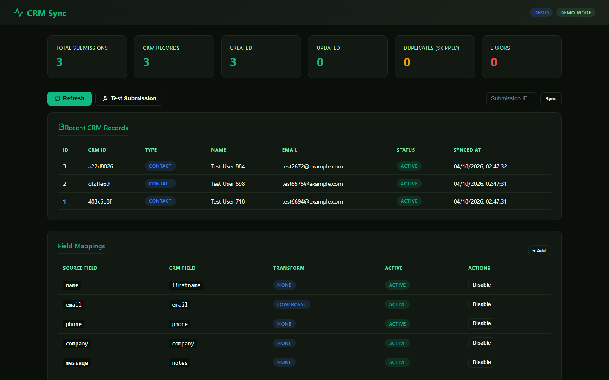
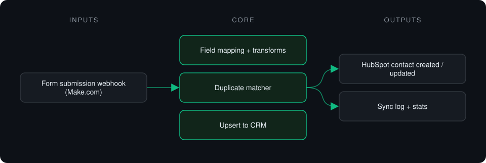
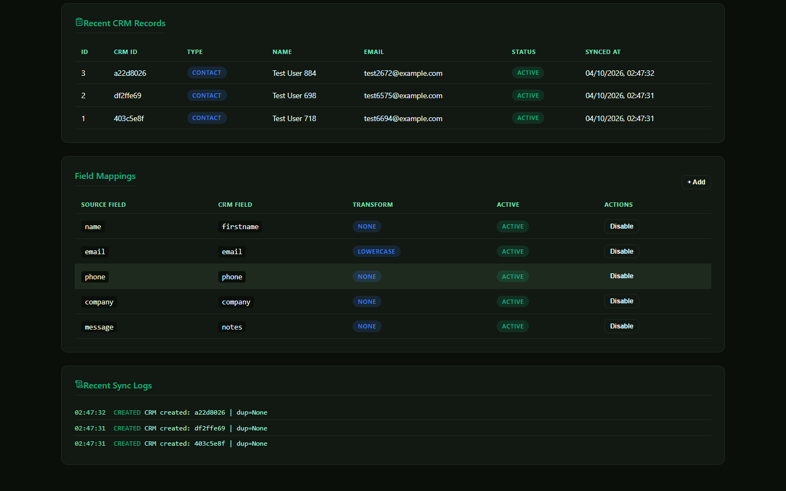

# Make CRM Sync

**Webhook receiver that normalizes form submissions and syncs them to HubSpot with email, phone and name-based deduplication.**

> **This is a proprietary project. Source code is private. This page showcases the system's architecture and results.**

**Case study page:** [https://jryahia.github.io/showcase-make-crm-sync/](https://jryahia.github.io/showcase-make-crm-sync/)

## Problem it solves

Form-to-CRM automations often create duplicate contacts and inconsistent fields. This service normalizes every submission and matches it against existing records before creating or updating anything. It is built as the webhook backend for a Make.com scenario: the automation platform handles triggers, and this service holds the logic and data.

## Architecture

1. A form submission arrives at the webhook.
2. Fields are mapped and normalized.
3. The record is matched against existing contacts.
4. A contact is created or updated, and the result is logged.

## Key features

- Configurable field mappings and transforms
- Deduplication before every write
- Manual re-sync per submission
- Sync statistics and logs
- Mock HubSpot client for demos

## Tech stack

     

## What it does in practice

- Keeps the CRM clean while forms keep feeding it.

## Screenshots

**Synced records and field mappings**

**Field mappings and sync log**

---

Built by [Yahya Jarray](https://github.com/jryahia). Interested in a similar system? [Get in touch](mailto:yahiajarray43@gmail.com).
